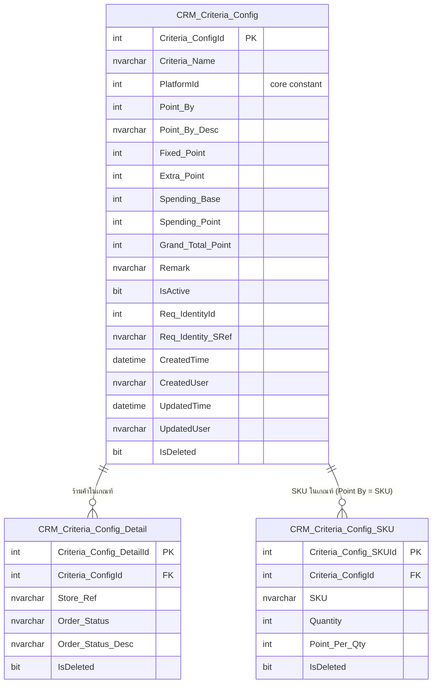

# Schema — Marketplace Point Criteria

กลับไป [[00-Overview]] · ดู mapping [[02-UI-Mapping]]

## ER Diagram

## CRM_Criteria_Config (header)
1 แถว = 1 เกณฑ์การให้คะแนน (1 แถวในหน้า List)

| Column              | Type           | Null | Note                                                                                                                                                  |
| ------------------- | -------------- | ---- | ----------------------------------------------------------------------------------------------------------------------------------------------------- |
| `Criteria_ConfigId` | int (identity) | No   | **PK**                                                                                                                                                |
| `Criteria_Name`     | nvarchar(200)  | No   | "ชื่อเกณฑ์"                                                                                                                                           |
| `PlatformId`        | int            | No   | code ของ platform (Shopee/Lazada/Tiktok/MyShop) — อ้าง Constants ใน core, desc ได้จาก `GetDesc()` ไม่ต้องเก็บ column แยก · [[03-Platform-Constant]]   |
| `Point_By`          | int            | No   | code เรียง 1–7 ตรงกับ 7 ตัวเลือกใน dropdown (single 3 + combo 4) — เช็ค mode ด้วย `PointBy.HasFixed/HasSpending/HasSkus` · ดู [[04-PointBy-Constant]] |
| `Point_By_Desc`     | nvarchar(100)  | No   | ข้อความ mode ที่เลือก (เช่น "Fixed points + SKUs")                                                                                                    |
| `Fixed_Point`       | int            | No   | mode **FIXED** — แต้มคงที่ต่อออเดอร์ที่เข้าเกณฑ์ (0 ถ้าไม่เปิด FIXED)                                                                                 |
| `Extra_Point`       | int            | No   | mode **FIXED** — แต้ม Extra บวกเพิ่มต่างหากจาก `Fixed_Point` (0 ถ้าไม่เปิด FIXED)                                                                     |
| `Spending_Base`     | int            | No   | mode **SPENDING** — ยอดใช้จ่ายต่อรอบ เช่น 500 (บาท) (0 ถ้าไม่เปิด SPENDING)                                                                           |
| `Spending_Point`    | int            | No   | mode **SPENDING** — แต้มต่อ 1 `Spending_Base` เช่น 10 → "ใช้ 500 ได้ 10 point" เก็บไว้ cal กับยอดบิลตอน earn (0 ถ้าไม่เปิด SPENDING)                  |
| `Grand_Total_Point` | int            | No   | ส่วนคงที่ที่รู้ตอน save = `Fixed_Point + Extra_Point` เท่านั้น; **SPENDING + SKUS ไม่รวม** เพราะต้องเห็นยอดบิล/รายการ item จริงก่อน (คำนวณตอน earn)    |
| `Remark`            | nvarchar(500)  | Yes  | หมายเหตุ                                                                                                                                              |
| `IsActive`          | bit            | No   | สถานะ ใช้งานอยู่ / ไม่ใช้งาน (toggle)                                                                                                                 |
| `Req_IdentityId`    | int            | No   | audit — ผู้ทำรายการ                                                                                                                                   |
| `Req_Identity_SRef` | nvarchar(100)  | No   | audit                                                                                                                                                 |
| `CreatedTime`       | datetime       | No   | audit                                                                                                                                                 |
| `CreatedUser`       | nvarchar(100)  | No   | audit                                                                                                                                                 |
| `UpdatedTime`       | datetime       | No   | audit — ใช้แสดง "Lasted Update"                                                                                                                       |
| `UpdatedUser`       | nvarchar(100)  | No   | audit                                                                                                                                                 |
| `IsDeleted`         | bit            | No   | soft delete                                                                                                                                           |

## CRM_Criteria_Config_Detail (detail)
1 แถว = 1 ร้านค้าที่ถูกเลือกในเกณฑ์ พร้อมสถานะออเดอร์ที่ทำให้ได้คะแนน

| Column | Type | Null | Note |
|---|---|---|---|
| `Criteria_Config_DetailId` | int (identity) | No | **PK** |
| `Criteria_ConfigId` | int | No | **FK → `CRM_Criteria_Config.Criteria_ConfigId`** |
| `Store_Ref` | nvarchar(100) | No | ร้านค้าของ channel ที่เลือก (เช่น Choco Official Store) |
| `Order_Status` | nvarchar(64) | No | "เลือกสถานะให้คะแนน" — **raw token ของ platform นั้นตรงๆ** (เช่น Shopee `"COMPLETED"`, Lazada `"delivered"`) ใช้ match กับ status จาก hub · [[06-OrderStatus-Mapping]] |
| `Order_Status_Desc` | nvarchar(100) | Yes | label แสดงบน UI (เช่น "จัดส่งสำเร็จ") |
| `IsDeleted` | bit | No | soft delete |

## CRM_Criteria_Config_SKU (detail — SKU)
1 แถว = 1 SKU ที่ถูกเลือกในเกณฑ์ — **1 เกณฑ์มี SKU ได้มากกว่า 1** (ใช้ตอน `Point_By` = by SKU)

| Column | Type | Null | Note |
|---|---|---|---|
| `Criteria_Config_SKUId` | int (identity) | No | **PK** |
| `Criteria_ConfigId` | int | No | **FK → `CRM_Criteria_Config.Criteria_ConfigId`** |
| `SKU` | nvarchar(100) | No | รหัส SKU ที่เลือก (ตรงกับ `CRM_Item.SKU` / `ItemListResp.Sku`) |
| `Quantity` | int | No | จำนวนชิ้นต่อรอบ (Pc(s)) — base เหมือน `Spending_Base` |
| `Point_Per_Qty` | int | No | "Point/Qt." — แต้มต่อ 1 รอบ (`Quantity` ชิ้น) |
| `IsDeleted` | bit | No | soft delete |

> **SKU คำนวณตอน earn ไม่ใช่ตอน save** (เหมือน SPENDING) — ต้องเห็นรายการ item ในออเดอร์จริงก่อน. config เก็บแค่ **rule** (`SKU` + `Quantity` + `Point_Per_Qty`) ไม่เก็บยอดแต้ม
> - ตอน earn: หา item ในออเดอร์ที่ SKU ตรงแถวนี้ → `floor(จำนวนที่ซื้อ / Quantity) × Point_Per_Qty` (ยืนยัน rule ตัด/ปัดกับ hub)
> - "Total Point" read-only ใต้ SKUs บน UI = **preview ฝั่งหน้าบ้าน** (`Σ Quantity × Point_Per_Qty` สมมติซื้อพอดี 1 รอบ) — ไม่เก็บลง DB, ไม่ใช่ยอดที่ได้จริง

## Index ที่แนะนำ
- `CRM_Criteria_Config`: index บน `PlatformId`, `IsDeleted` (filter หน้า List)
- `CRM_Criteria_Config_Detail`: index บน `Criteria_ConfigId` (join กลับ header)
- `CRM_Criteria_Config_SKU`: index บน `Criteria_ConfigId` (join กลับ header)
