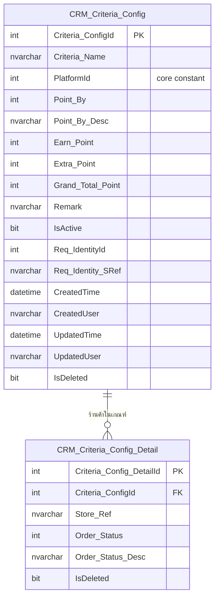

# Schema — Marketplace Point Criteria

กลับไป [[00-Overview]] · ดู mapping [[02-UI-Mapping]]

## ER Diagram

## CRM_Criteria_Config (header)
1 แถว = 1 เกณฑ์การให้คะแนน (1 แถวในหน้า List)

| Column              | Type           | Null | Note                                                                                                                                                |
| ------------------- | -------------- | ---- | --------------------------------------------------------------------------------------------------------------------------------------------------- |
| `Criteria_ConfigId` | int (identity) | No   | **PK**                                                                                                                                              |
| `Criteria_Name`     | nvarchar(200)  | No   | "ชื่อเกณฑ์"                                                                                                                                         |
| `PlatformId`        | int            | No   | code ของ platform (Shopee/Lazada/Tiktok/MyShop) — อ้าง Constants ใน core, desc ได้จาก `GetDesc()` ไม่ต้องเก็บ column แยก · [[03-Platform-Constant]] |
| `Point_By`          | int            | No   | การให้คะแนน "Point By" (dropdown) — code ของ mode                                                                                                   |
| `Point_By_Desc`     | nvarchar(100)  | No   | ข้อความ mode ที่เลือก                                                                                                                               |
| `Earn_Point`        | int            | No   | Earn Point                                                                                                                                          |
| `Extra_Point`       | int            | No   | Extra                                                                                                                                               |
| `Grand_Total_Point` | int            | No   | = Earn_Point + Extra_Point (คำนวณตอน save)                                                                                                          |
| `Remark`            | nvarchar(500)  | Yes  | หมายเหตุ                                                                                                                                            |
| `IsActive`          | bit            | No   | สถานะ ใช้งานอยู่ / ไม่ใช้งาน (toggle)                                                                                                               |
| `Req_IdentityId`    | int            | No   | audit — ผู้ทำรายการ                                                                                                                                 |
| `Req_Identity_SRef` | nvarchar(100)  | No   | audit                                                                                                                                               |
| `CreatedTime`       | datetime       | No   | audit                                                                                                                                               |
| `CreatedUser`       | nvarchar(100)  | No   | audit                                                                                                                                               |
| `UpdatedTime`       | datetime       | No   | audit — ใช้แสดง "Lasted Update"                                                                                                                     |
| `UpdatedUser`       | nvarchar(100)  | No   | audit                                                                                                                                               |
| `IsDeleted`         | bit            | No   | soft delete                                                                                                                                         |

## CRM_Criteria_Config_Detail (detail)
1 แถว = 1 ร้านค้าที่ถูกเลือกในเกณฑ์ พร้อมสถานะออเดอร์ที่ทำให้ได้คะแนน

| Column | Type | Null | Note |
|---|---|---|---|
| `Criteria_Config_DetailId` | int (identity) | No | **PK** |
| `Criteria_ConfigId` | int | No | **FK → `CRM_Criteria_Config.Criteria_ConfigId`** |
| `Store_Ref` | nvarchar(100) | No | ร้านค้าของ channel ที่เลือก (เช่น Choco Official Store) |
| `Order_Status` | int | No | "เลือกสถานะให้คะแนน" — code ของสถานะออเดอร์ |
| `Order_Status_Desc` | nvarchar(100) | No | รอชำระเงิน / ชำระเงินสำเร็จ / อยู่ระหว่างการจัดส่ง / จัดส่งสำเร็จ |
| `IsDeleted` | bit | No | soft delete |

## Index ที่แนะนำ
- `CRM_Criteria_Config`: index บน `PlatformId`, `IsDeleted` (filter หน้า List)
- `CRM_Criteria_Config_Detail`: index บน `Criteria_ConfigId` (join กลับ header)
