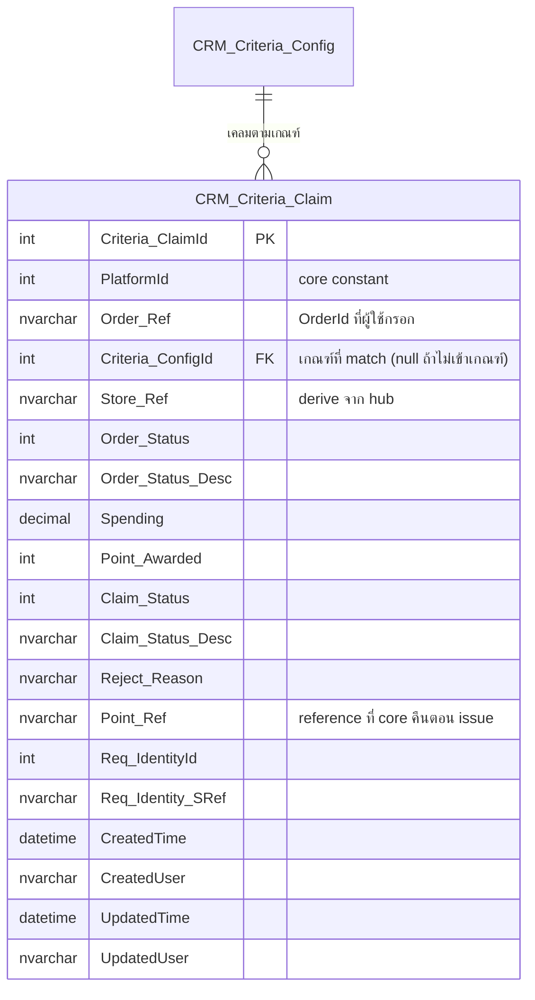

# Schema — Marketplace Point Earn

กลับไป [[00-Overview]] · ดู flow [[02-Flow]] · เกณฑ์ที่อ้าง [[../Marketplace-Point-Criteria/01-Schema]]

## ER Diagram

## CRM_Criteria_Claim
1 แถว = 1 ครั้งที่ลูกค้าเคลมแต้มจาก 1 ออเดอร์ marketplace

| Column | Type | Null | Note |
|---|---|---|---|
| `Criteria_ClaimId` | int (identity) | No | **PK** |
| `PlatformId` | int | No | `LmsMarketplaceConst.Platform` — ผู้ใช้เลือก |
| `Order_Ref` | nvarchar(100) | No | `OrderId` ที่ผู้ใช้กรอก |
| `Criteria_ConfigId` | int | Yes | **FK → `CRM_Criteria_Config`** — เกณฑ์ที่ match, null = ไม่เข้าเกณฑ์ (บันทึกไว้เป็นประวัติ/กันเคลมซ้ำ) |
| `Store_Ref` | nvarchar(100) | Yes | ร้านค้า — derive จาก hub |
| `Order_Status` | int | Yes | สถานะออเดอร์ตอนเคลม — derive จาก hub |
| `Order_Status_Desc` | nvarchar(100) | Yes | ข้อความสถานะ |
| `Spending` | decimal(18,2) | Yes | ยอดออเดอร์ที่ hub คืน (ใช้ตอน `Point_By` = by spending) |
| `Point_Awarded` | int | No | แต้มที่ให้จริง (0 ถ้า reject) |
| `Claim_Status` | int | No | สถานะการเคลม — code |
| `Claim_Status_Desc` | nvarchar(100) | No | Success / Rejected / Pending |
| `Reject_Reason` | nvarchar(500) | Yes | เหตุผลกรณี reject (ไม่เข้าเกณฑ์ / เคลมซ้ำ / order ไม่พบ) |
| `Point_Ref` | nvarchar(100) | Yes | reference ที่ core คืนตอน issue point (โยงไป point ledger) |
| `Req_IdentityId` | int | No | audit — ลูกค้าที่เคลม |
| `Req_Identity_SRef` | nvarchar(100) | No | audit |
| `CreatedTime` | datetime | No | audit — เวลาเคลม |
| `CreatedUser` | nvarchar(100) | No | audit |
| `UpdatedTime` | datetime | No | audit |
| `UpdatedUser` | nvarchar(100) | No | audit |

> ไม่มี `IsDeleted` — claim เป็น transaction ห้ามลบ (soft ก็ไม่ควร) เพราะเป็นหลักฐานการให้แต้ม

## Index / Constraint
- **UNIQUE `(PlatformId, Order_Ref)`** — กันเคลมซ้ำออเดอร์เดิม (หัวใจของขานี้)
  - `ponytail:` unique constraint กันซ้ำที่ระดับ DB พอ ไม่ต้อง lock ใน app; ถ้าจะให้เคลมใหม่หลัง reject ได้ ค่อยเปลี่ยนเป็น filtered unique เฉพาะ Claim_Status = Success
- index บน `Req_IdentityId` — query ประวัติเคลมของลูกค้า
- index บน `Criteria_ConfigId` — โยงกลับเกณฑ์

## Claim_Status (เสนอ)
| code | Desc | เมื่อไหร่ |
|---|---|---|
| 1 | Success | match เกณฑ์ + ออกแต้มสำเร็จ |
| 2 | Rejected | ไม่เข้าเกณฑ์ / order ไม่พบ / สถานะไม่ตรง |
| 3 | Pending | (ถ้ามี async กับ hub) — ยังไม่ยืนยัน |

> ค่าจริงยึด pattern `LmsOrderingMethodConst.Type` (int const + Desc + GetDesc) เหมือนฝั่ง Criteria
