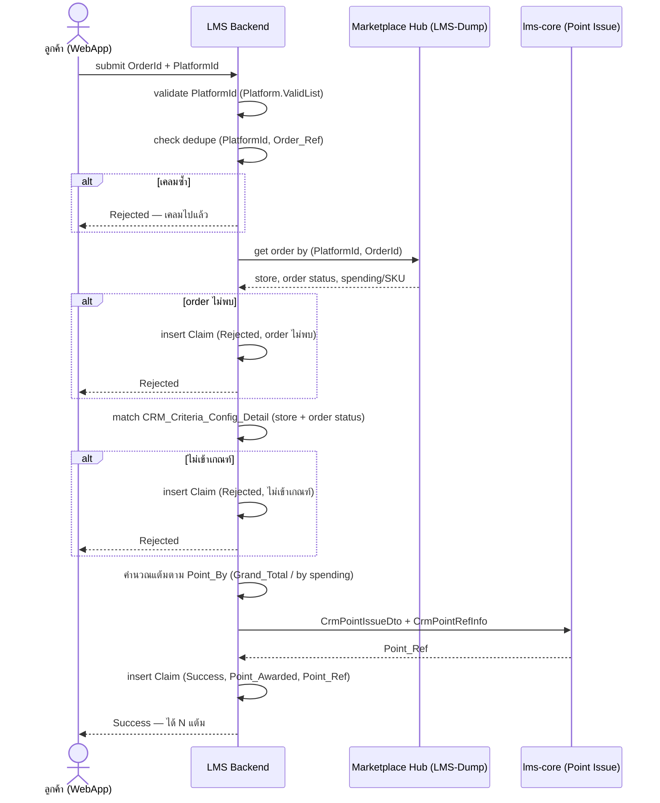

# Flow — Marketplace Point Earn (WebApp)

กลับไป [[00-Overview]] · schema [[01-Schema]]

## Sequence

## จุด validate (ตามลำดับ)
1. `PlatformId` อยู่ใน `Platform.ValidList` — ไม่งั้น 400
2. **dedupe** — มี `(PlatformId, Order_Ref)` แล้วหรือยัง (unique constraint กันชั้นสุดท้ายที่ DB)
3. order มีจริงใน hub + เป็นของลูกค้าคนนี้ (กันเคลม order คนอื่น)
4. store ของ order อยู่ใน `Config_Detail` ของเกณฑ์ที่ active
5. `Order_Status` ตรงกับที่เกณฑ์กำหนดให้แต้ม

ทุก reject **ยัง insert Claim** (สถานะ Rejected + reason) เพื่อเป็นประวัติ + กันสแปมกดซ้ำ

## การคำนวณแต้ม
อ้าง `Point_By` ของเกณฑ์ที่ match:
- โหมด flat → `Point_Awarded = Grand_Total_Point`
- โหมด by spending → ส่ง `Spending` เข้า `CrmPointIssueDto` ให้ core คำนวณ (`Point_Calc` = Default/Config)

> ยังไม่ fix สูตร by-spending จนกว่าชุดค่า `Point_By` จะยืนยัน (open point ฝั่ง Criteria) — [[../Marketplace-Point-Criteria/02-UI-Mapping]]

## Open Points
1. **ownership ของ order** — hub คืน customer ของ order ไหม? ต้องเทียบกับ identity ที่ login เพื่อกันเคลม order คนอื่น (ข้อ validate 3) — **ยืนยัน field จาก hub**
2. **สถานะออเดอร์เปลี่ยนทีหลัง** — เคลมตอน "รอชำระเงิน" แล้วได้แต้ม ถ้าออเดอร์ถูกยกเลิกทีหลังจะ claw back แต้มไหม? ถ้าใช่ ต้องมี job ตาม hub + reverse point
   - `ponytail:` เริ่มด้วยให้เคลมได้เฉพาะสถานะ final (เช่น จัดส่งสำเร็จ) เลี่ยง claw back ทั้งหมด ถ้า requirement ยอม
3. **async กับ hub** — ถ้า hub ตอบช้า/ต้อง callback ค่อยใช้ `Claim_Status = Pending` + reconcile ทีหลัง (ตอนนี้ออกแบบเป็น sync)
