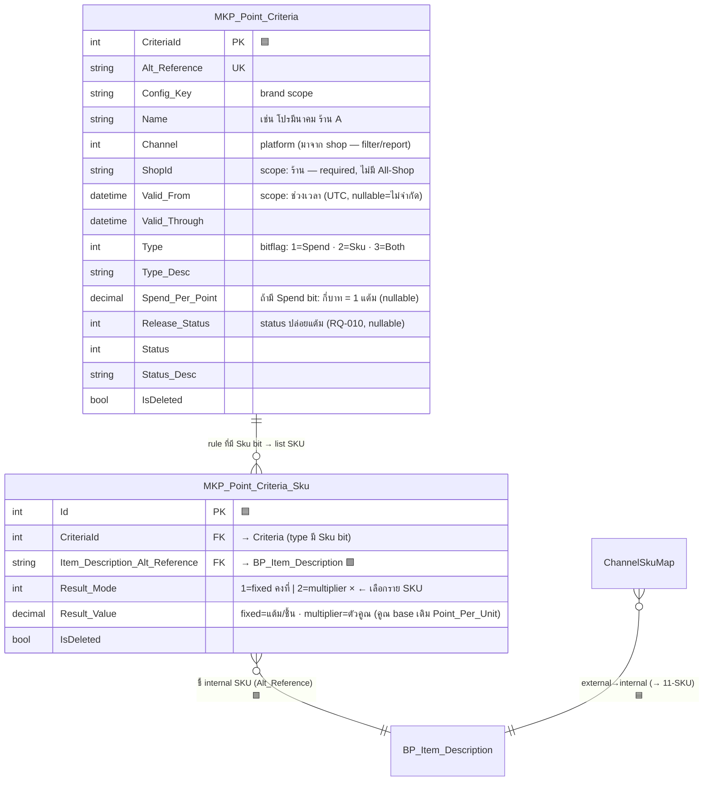
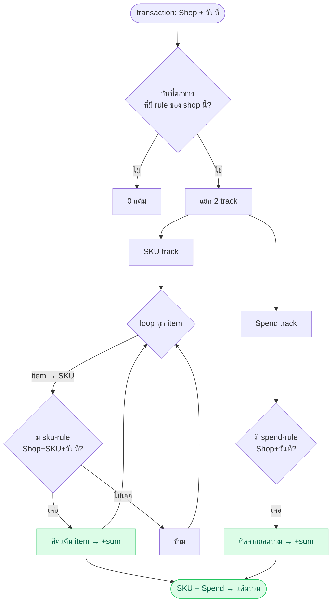
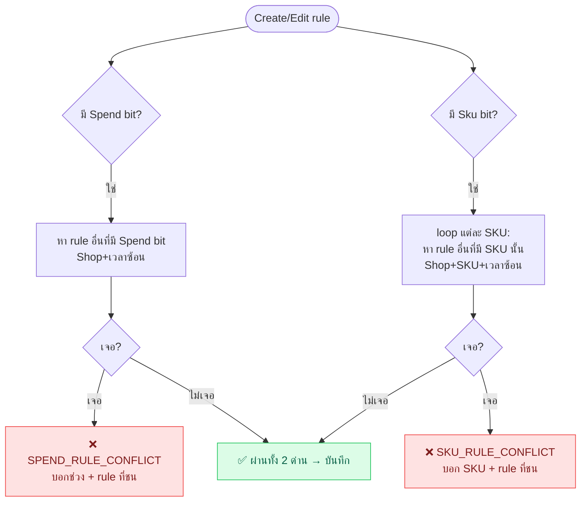

# Phase 1 — Criteria Config

> [!warning] รอ UI
> ต้องรอ UI ตกลง schema/action ที่จะส่งมาก่อน ถึงจะ finalize model ฝั่ง backend

## สถานะ
- [x] เข้าใจ action ที่มีคร่าวๆ แล้ว
- [ ] สรุป list action ทั้งหมด (พร้อม input/output แต่ละอัน)
- [ ] สรุป schema config ที่ UI จะส่ง (JSON? table?)
- [ ] map: config 1 อัน → คิดแต้มยังไง (สูตร, exp)

## Criteria คืออะไรในบริบทนี้
เงื่อนไข/กติกาที่ใช้ตัดสินว่า order นี้ **เข้าเงื่อนไขไหน** และ **คิดแต้มเท่าไหร่ + หมดอายุเมื่อไหร่**
- 1 order → **match ได้หลาย rule** (spend + sku หลายตัว) → **บวกกันหมด (stack)**, ไม่มีการชนเพราะ config-time กันซ้ำ `Shop+SKU+เวลา` ไว้แล้ว → ดู §ตอนคิดแต้ม ด้านล่าง

| ประเภท | เงื่อนไข (ตัวอย่าง) | ผลลัพธ์ |
|--------|--------------------|---------|
| **Spend** | ทุกยอดใช้จ่าย X บาท | ได้ Y แต้ม |
| **Sku** | ซื้อ SKU ที่ระบุ (ตั้งทีละรายการ) | คงที่ / คูณ (ราย SKU) |
| **Both** | ตั้งทั้ง 2 ในกฎเดียว | spend + sku **บวกกัน** |

## 🗄️ Database Design (ร่างแรก — mirror pattern เดิม)
> [!warning] draft · รอ UI ยืนยัน field
> ยึด convention เดิมของ `CRM_Privilege_Criteria_Group` + `_Condition`: `Alt_Reference` UK,
> `Status`+`Status_Desc`, audit (`Req_Identity_SRef`, Created/Updated), soft delete `IsDeleted`
> (แต่ **ไม่เอา `Priority`** ของ pattern เดิม — เราตัดทิ้ง)
> **ยุบ Group ทิ้ง** (priority ตัดแล้ว Rule Set ไม่จำเป็น) → เหลือ **2 table**: `MKP_Point_Criteria` (config: scope + spend + type) → `MKP_Point_Criteria_Sku` (list SKU)



**ตารางสรุป**
| Table | สถานะ | หน้าที่ |
|-------|-------|---------|
| `MKP_Point_Criteria` | 🟦 ใหม่ | **1 config = ทุกอย่าง**: scope (Shop+Channel+ช่วงเวลา) + `Type` bitflag **Spend/Sku/Both** + `Spend_Per_Point` — **ไม่มี Priority/Group/Cap** |
| `MKP_Point_Criteria_Sku` | 🟦 ใหม่ | ราย SKU: เลือก **คงที่ / คูณ** (× คูณ base เดิม `Point_Per_Unit`) → ชี้ `BP_Item_Description.Alt_Reference` |
| `BP_Item_Description` | 🟩 เดิม | internal SKU (ปลายทางที่ criteria + [[11-SKU|ChannelSkuMap]] ชี้ตรงกัน) |
| `BP_Item_Point_Config` | 🟩 เดิม | `Point_Per_Unit` = **base** ที่ multiplier ราย SKU เอาไปคูณ → [[11-SKU]] |

> 💡 **ตัวคูณ (×) มีเฉพาะราย SKU** — spend คิดตรงๆ (บาท→แต้ม) · sku แต่ละตัวเลือกเองว่า **คงที่** (กำหนดแต้ม/ชิ้น) หรือ **คูณ** (× ค่า `Point_Per_Unit` เดิมของ SKU นั้น)

> 🔀 **Type = bitflag (Spend=1, Sku=2, Both=3)** — ใช้ convention เดียวกับ `ReceiptPointType` ของ Document module (แงะเจอใน [[11-SKU]]) · **Both** = rule เดียวเก็บทั้ง `Spend_Per_Point` + list SKU → ตอนคิดแต้มป้อนทั้ง 2 track แล้วบวกกัน (ดีไซน์ runtime เดิมรองรับอยู่แล้ว ไม่ต้องแก้)

**flow ใช้งาน (ต่อ [[11-SKU]]):**
```
order line (ShopId, External_Sku) → ChannelSkuMap → Item_Description_Alt_Reference
   ↓
[Sku bit] match MKP_Point_Criteria_Sku ของ SKU นั้น · [Spend bit] eval Spend_Per_Point จากยอดรวม
   ↓ (ไม่ต้อง priority — config-time กันซ้ำ per component ไว้แล้ว)
คิดผล (sku: ×/คงที่ · spend: บาท→แต้ม) → รวมแต้ม
```

## ✅ ตอนคิดแต้ม (runtime) — ไม่มี conflict ให้ตัดสิน
> [!check] ตัดสินใจ: **ไม่ทำ Priority + บังคับเลือก Shop (ไม่มี All-Shop)** เพื่อลดความยุ่งยาก
> config-time การันตีว่า `(Shop, SKU, ช่วงเวลา)` มี sku-rule ได้แค่ 1 · `(Shop, ช่วงเวลา)` มี spend-rule ได้แค่ 1
> → runtime **ไม่มีทางเจอกฎชนกัน** แค่ match แล้วบวก ไม่ต้องมีตัวตัดสิน

**เช็ค Shop + วันที่ก่อน แล้วเดิน 2 track แยกกัน → บวกแต้มรวม:**
```
transaction เข้า → รู้ Shop + วันที่
   ↓ วันที่ตกช่วงไหน → ได้ rule ของ shop นั้นในช่วงนั้น
[SKU track]  loop ทุก item ใน order:
     item → SKU → หา sku-rule (Shop, SKU, ครอบวันที่)
        เจอ  → คิดแต้ม item นั้น (× / คงที่) → +sum
        ไม่เจอ → ข้าม item
[Spend track]  หา spend-rule (Shop, ครอบวันที่)
        เจอ  → คิดจากยอดรวม → +sum
   ↓
รวม SKU-points + Spend-points → แต้มสุดท้าย
```
> SKU กับ Spend **บวกกัน (stack)** — คนละแหล่งแต้ม ไม่ใช่การชน
> rule แบบ **Both** = ป้อนทั้ง 2 track จาก rule เดียว (spend part → Spend track · SKU list → SKU track) ผลเหมือนตั้ง 2 rule แยกแต่จบใน config เดียว



**ตัวอย่าง:** order Shopee **ร้าน A**, **15 มี.ค.**, มี **SKU-A ×2, SKU-B ×1**, ยอด 800฿
rule ของร้าน A ที่ครอบ 15 มี.ค.:
| rule | type | จับ | ผล |
|------|------|-----|----|
| R1 | spend | ยอดรวม | 100฿ = 1 แต้ม |
| R2 | sku | SKU-A | mode=**คูณ ×2** (base `Point_Per_Unit`=5 → 5×2=10/ชิ้น) |

สมมติ SKU-A `Point_Per_Unit` เดิม = 5 · (SKU-B ไม่มี rule)
- **SKU track:** SKU-A เจอ R2 → คูณ: (5×2) × qty 2 = **20 แต้ม** · SKU-B ไม่มี rule → ข้าม
- **Spend track:** R1 → 800/100 = **8 แต้ม**
- **รวม = 20 + 8 = 28** → จบ
> ถ้า R2 เป็น mode=**คงที่** ค่า 3 → SKU-A ได้ 3×qty2 = 6 (ไม่สน base) — เลือกได้ราย SKU

ไม่มีขั้นตอน "เลือกใครชนะ" เลย — R1/R2 คนละ track และ config-time กันซ้ำ `Shop+SKU+เวลา` ไว้แล้ว
> 🔀 ถ้ารวม R1+R2 เป็น **rule เดียว Type=Both** (เก็บ `Spend_Per_Point` + SKU-A ในกฎเดียว) ผลลัพธ์ **28 เท่าเดิม** — Both แค่ย้ายจาก 2 config มาไว้ config เดียว

## 🛡️ config-time validate — หัวใจที่ทำให้ไม่ต้องมี priority
> บังคับ **เลือก Shop เสมอ** (ไม่มี All-Shop) → เทียบตรงๆ ได้ · validate ตอน Create/Edit กันซ้ำตั้งแต่ตั้งกฎ

**validate ราย component (ตาม bit)** (เวลาซ้อน = `a.From <= b.Through AND b.From <= a.Through`, null=±∞):

> [!note] ขอบเขตเป็น inclusive ทั้ง 2 ด้าน `[From, Through]`
> วันชนขอบ **ถือว่าชน** — rule A ถึง **15 มี.ค.** + rule B เริ่ม **15 มี.ค.** = block (15 อยู่ทั้งคู่ → order วันนั้นกำกวม)
> → ให้ admin ไปแก้ B เป็นเริ่ม **16 มี.ค.** เอง (ไม่ auto-adjust ให้)

> ⚠️ เช็ค **ราย component** (ตาม bit) ไม่ใช่ราย Type — rule แบบ **Both** มีทั้ง 2 component → ต้องผ่านทั้ง 2 ด่าน (spend part ของ Both ชนกับ Spend-only ได้ถ้า shop+เวลาเดียวกัน)

**ถ้า rule มี Spend bit** — ห้าม `(Shop, ช่วงเวลา)` ซ้อน:
```
หา rule active อื่น ที่ "มี Spend bit" (Spend หรือ Both) · Shop เดียวกัน + เวลาซ้อน → เจอ → ❌ Error
```
**ถ้า rule มี Sku bit** — ห้าม `(Shop, SKU, ช่วงเวลา)` ซ้อน → เช็ค **รายตัว SKU** ใน list:
```
สำหรับแต่ละ SKU ใน rule ใหม่:
  หา rule active อื่น ที่ "มี Sku bit" (Sku หรือ Both) และมี SKU ตัวนี้ · Shop เดียวกัน + เวลาซ้อน
  เจอ → ❌ Error
```

**Error response (ตามที่อยากได้ — บอกช่วงเวลา + rule ที่ชน):**
```jsonc
// SKU ชน
{ "status": "error", "code": "SKU_RULE_CONFLICT",
  "message": "SKU-A ช่วง 01–31 มี.ค. ชนกับ Rule: โปรมีนาคม ร้าน A (01–15 มี.ค.)" }

// Spend ชน
{ "status": "error", "code": "SPEND_RULE_CONFLICT",
  "message": "ช่วง 01–31 มี.ค. ชนกับ Rule: Spend ร้าน A (15 มี.ค.–30 เม.ย.)" }
```



> เพราะกันซ้ำที่ `(Shop, SKU/Spend, เวลา)` ตั้งแต่ตั้งกฎ → runtime เจอ rule ตรงตัวไม่เกิน 1 เสมอ → **ไม่ต้องมี priority**
> 💸 ราคาที่จ่าย: อยากได้ promo ทั้งแบรนด์ = ต้องตั้งซ้ำทีละร้าน (ไม่มี All-Shop) → แลกกับความง่ายที่ตัด priority ทิ้ง

**จุดที่ต้องตัดสินใจ (ก่อน finalize)** → รวมที่ [[05-Open-Questions]]
- [x] **ยุบ Group ทิ้ง** → 2 table
- [x] **ไม่มี Cap ก่อน (YAGNI)** — ยังไม่มี requirement เพดานจริง · ถ้าเพิ่มทีหลัง → **shop-level clamp ผลรวม** (ไม่ใช่ราย config เพราะ 1 order match หลาย config = cap บวกกันพัง)
- [x] `Result_Mode` → **อยู่ราย SKU** (per SKU เลือก คงที่/คูณ) · คูณ = ×base เดิม `Point_Per_Unit` · spend ไม่มีคูณ
- [x] spend + sku ใน order เดียว → **stack (บวกกัน)** คนละ track
- [x] ~~Priority~~ → **ตัดทิ้ง** · ~~All-Shop~~ → **ตัดทิ้ง (บังคับเลือกร้าน)** — รับ trade-off "ให้ admin เหนื่อยตั้งแทน" · กันชนที่ config-time validate
- [ ] prefix `MKP_` ตรง convention brand ไหม หรือใช้ `CRM_Point_Criteria_*`

## อ้างอิงของเดิมในโค้ด (ดูเป็น pattern)
มี criteria แนวนี้อยู่แล้วในหลายที่ — ไปดูรูปแบบเก็บ config/exp ได้:
- `Choco.LMS.Core/Services/Privilege/LmsPrivilegeService_CriteriaGroup.cs`
- `Choco.LMS.Core/Services/Membership/LmsMembershipService.cs` (มี `Criteria.ExpCalcMode` Default/Custom)
- Exp calc pattern เดียวกับ [[02-AddFundsV2-Usage]] (Default vs Custom)