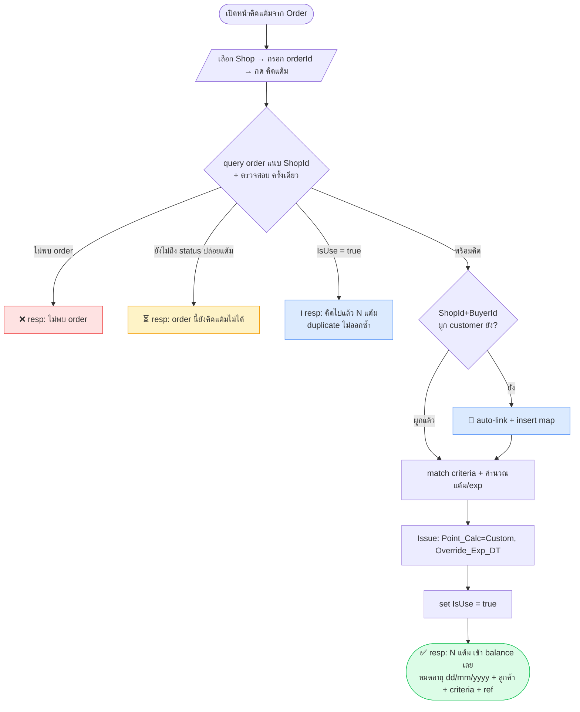

# User Journey — user ต้องทำอะไรบ้าง

> [!info] มี 3 actor
> **(A) Brand/Shop admin** = ตั้งค่าระบบ · **(B) Operator/CRM** = กรอก order คิดแต้ม (งานหลักเรา) · **(C) ลูกค้า** = ผูกบัญชี
> งานที่คุณทำอยู่ = **journey B** เป็นหลัก (ต้องพึ่ง A ตั้งค่าไว้ก่อน)

---

## (A) Brand/Shop admin — ตั้งค่า (ทำครั้งเดียว/เป็นครั้งคราว)
เตรียมของให้ journey B ทำงานได้

1. เชื่อม **Channel/Account MKP** (Shopee/Lazada/Tiktok) — sync บัญชีร้าน
2. สร้าง **Point Criteria** (ต่อร้าน — ไม่มี All-Shop) → [[01-Criteria-Config]]
   - เลือก Type: **Spend / Sku / Both**
   - sku ราย SKU เลือก คงที่/คูณ · spend ตั้งบาท→แต้ม · + ช่วงเวลา (ยังไม่มี cap)
   - (ไม่มี priority — ตั้ง scope ทับกันไม่ได้ ระบบ block ให้)
3. ตั้ง **status ที่ปล่อยแต้ม** (เช่น Confirm/Complete) + solution Real-time หรือ T+1
4. เปิดใช้งาน (ACTIVE)

> ถ้ายังไม่มีข้อ 2 → journey B หา config ไม่เจอ = คิดแต้มไม่ได้ (ไม่มีให้แต้ม)

---

## (B) Operator/CRM — คิดแต้มจาก orderId ⭐ (งานเรา)
ตรงกับ [[03-Manual-Endpoint]]

**one-shot**: เลือก Shop → กรอก orderId → กดครั้งเดียว → ระบบทำจนจบแล้ว resp
```
1. เปิดหน้า "คิดแต้มจาก Order"
2. เลือก Shop/Channel (ร้านไหน) ► กรอก orderId ► [กด คิดแต้ม]  (ยิงครั้งเดียว)
3. ระบบทำในคำขอเดียว:
   query order (แนบ ShopId) → ได้ BuyerId → หา/auto-link BuyerId↔Customer [[08-Buyer-Customer-Mapping]]
   → match criteria → LmsCrmPointService.Issue (custom exp) [[02-AddFundsV2-Usage]] → set IsUse [[04-Data-IsUse-Flag]]
4. resp กลับตาม case:
   ├─ order ไม่เจอ         → "ไม่พบ order"
   ├─ order ยังไม่ถึง status ปล่อยแต้ม → "order นี้ยังคิดแต้มไม่ได้"
   ├─ คิดไปแล้ว           → "คิดแล้ว: N แต้ม เมื่อ..." (duplicate, ไม่ออกซ้ำ)
   └─ สำเร็จ              → "ออกแต้ม N แต้ม เข้าเลย หมดอายุ dd/mm/yyyy" + ลูกค้า + criteria + ref ledger
```

### Flow diagram (journey B)


**สถานะที่ user ต้องเห็นชัด (แต่ละ state):**
| state | user เห็น | ทำอะไรต่อได้ |
|-------|-----------|--------------|
| ไม่พบ order | error | ลองใหม่ |
| order ยังไม่ถึง status ปล่อยแต้ม | คิดแต้มไม่ได้ | รอ order confirm แล้วค่อยกดใหม่ |
| ยังไม่ผูก buyid | auto-link ให้ (ไม่บล็อก) | ไปต่อเลย |
| คิดไปแล้ว (IsUse) | info + จำนวนแต้มเดิม | ดูอย่างเดียว |
| ออกแต้มสำเร็จ | success: แต้มเข้า balance เลย + exp + ลูกค้า + ref | จบ |

> [!tip] one-shot ปลอดภัยเพราะ
> กดครั้งเดียวคิด+ออกแต้มเลย ไม่มี preview. กันพลาดด้วย **idempotent (orderId)** — ยิงซ้ำได้แต้มเดิม ไม่เบิ้ล;
> แต้ม deterministic จาก criteria; ออกผิดมี **VoidIssue** แก้ได้

---

## (C) ลูกค้า — ผูกบัญชี (prereq ของ B)
Buyer ID ↔ Customer ID — model ที่ [[08-Buyer-Customer-Mapping]] (key `(ShopId, BuyerId)`, N:1)
- **ปกติ auto-link ตอนคิดแต้ม** (journey B): ถ้า `(ShopId, BuyerId)` ยังไม่ผูก ระบบ insert map ให้เอง แล้วคิดแต้มต่อได้เลย — ลูกค้าไม่ต้องทำอะไร
- ลูกค้า 1 คนมีได้หลาย buyer (หลายร้าน/MKP) → ผูกเข้า CustomerId เดียวกันได้ (REQ-005)
- (ทางเลือก) ลูกค้าเชื่อม channel เอง / admin ผูก manual ก็ได้
- ⚠️ auto-link จับคู่ด้วย key อะไร (เบอร์/email/ชื่อ จาก order) ยังต้องเคลียร์ → [[05-Open-Questions]]

---

## เส้นเวลารวม (happy path)
```
[C] ลูกค้าผูกบัญชี  →  [A] admin ตั้ง criteria+status  →  order เกิดขึ้นจริงบน MKP
        →  [B] operator กรอก orderId → preview → ยืนยัน → แต้มเข้ากระเป๋า
```

## จุดตัดสินใจที่กระทบ journey (→ [[05-Open-Questions]])
- [x] preview+confirm หรือ one-shot → **one-shot** (ยิงครั้งเดียว คิด+ออกแต้ม แล้ว resp ว่าได้กี่แต้ม)
      เหตุผล: idempotent (orderId) กันซ้ำอยู่แล้ว · แต้ม deterministic จาก criteria · ผิดมี VoidIssue แก้ได้
- [x] เจอ order ยังไม่ผูก buyid → **auto-link ให้เลย** (ไม่บล็อก)
- [ ] auto-link ใช้ key อะไรจับคู่ buyid ↔ customer? (เบอร์โทร / ชื่อ / email จาก order MKP?) → กันผูกผิดคน
- [x] **ไม่ทำ Pending** — แต้มเข้า balance เลย ใช้ได้ทันที. order ยังไม่ถึง status ปล่อยแต้ม = คิดแต้มไม่ได้ (block ไว้เลย ไม่จองแต้ม)
