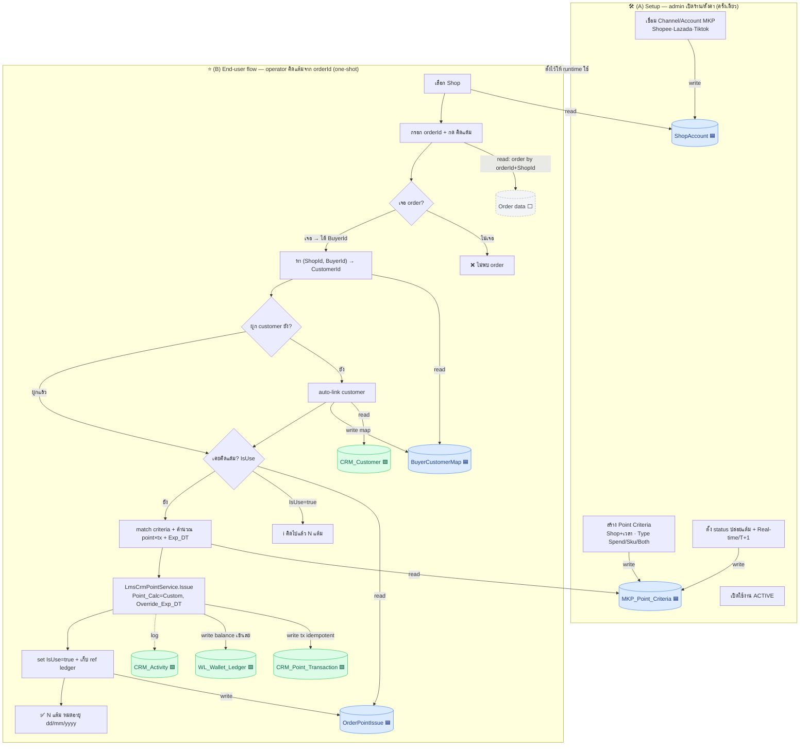
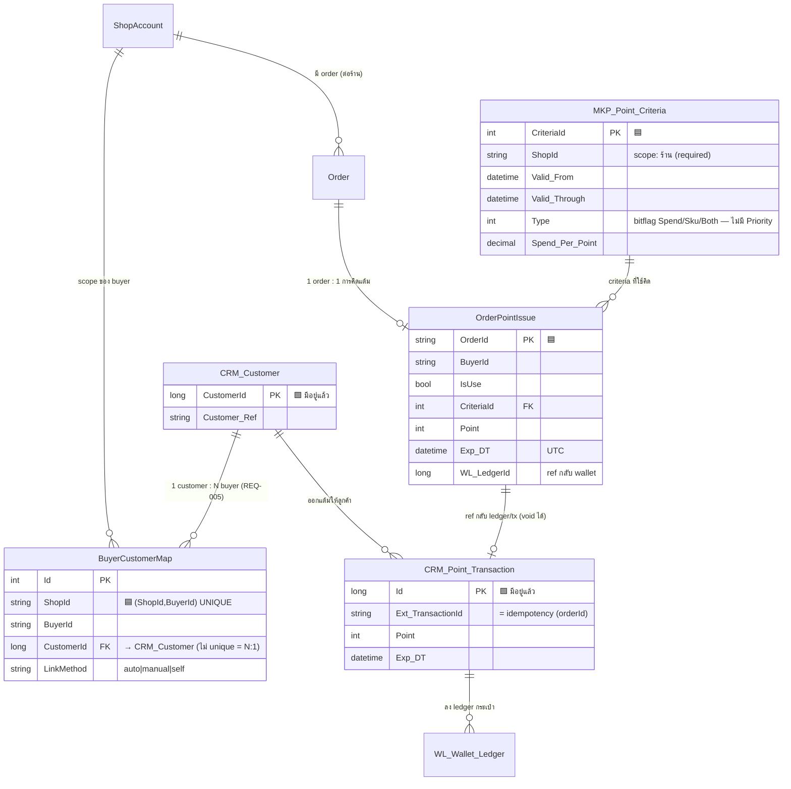

# System Relation Graph — Setup + End-User Flow + DB (คร่าวๆ)

> [!info] หน้านี้คืออะไร
> ภาพรวมหน้าเดียว: **(A) admin เปิดร้าน/ตั้งค่าอะไรก่อน** → **(B) end-user flow คิดแต้ม** →
> แต่ละ step แตะ **table ไหน** (อ่าน/เขียน). ยังเป็น **ร่าง** — ยึด [[00-Overview]] เป็นหลัก
>
> 🟩 มีจริงใน core (brand DB) · 🟦 ต้องสร้างใหม่ (งานเรา) · ⬜ ยังไม่รู้ table (open question [[05-Open-Questions]])

## 1) Flow + DB touch (relation graph)

## 2) Table relation (ER — ร่าง)

## 3) สรุป table ที่เกี่ยวข้อง
| Table | สถานะ | หน้าที่ | โน้ต |
|-------|-------|---------|------|
| `CRM_Customer` | 🟩 core | ลูกค้าในระบบเรา | — |
| `CRM_Point_Transaction` | 🟩 core | บันทึกออกแต้ม (idempotent ด้วย `Ext_TransactionId`) | [[02-AddFundsV2-Usage]] |
| `WL_Wallet_Ledger` | 🟩 core | ledger กระเป๋า — แต้มเข้า balance เลย ใช้ได้ทันที | — |
| `CRM_Activity` | 🟩 core | log กิจกรรม | — |
| `CRM_Config` / `CRM_Point_Campaign` | 🟩 core | อัตราแปลงแต้ม/campaign (เราใช้ Custom เลยไม่พึ่ง) | — |
| `ShopAccount` (ชื่อชั่วคราว) | 🟦 ใหม่ | channel/ร้าน MKP, ให้ `ShopId` | REQ-004/006 · [[08-Buyer-Customer-Mapping]] |
| `MKP_Point_Criteria` (+`_Sku`) | 🟦 ใหม่ | เกณฑ์คิดแต้ม: Shop+เวลา · Type Spend/Sku/Both · ไม่มี priority/Group/cap | [[01-Criteria-Config]] |
| `BuyerCustomerMap` | 🟦 ใหม่ | `(ShopId,BuyerId) → CustomerId` (N:1) | [[08-Buyer-Customer-Mapping]] |
| `OrderPointIssue` | 🟦 ใหม่ | flag IsUse + ref ledger | [[04-Data-IsUse-Flag]] |
| Order data | ⬜ ยังไม่รู้ | เก็บ order ฝั่งเรา (orderId, buyerId, ShopId, status) + **line-item ราย SKU** (สมมติว่ามี — prereq SKU track) | บล็อกอยู่ [[05-Open-Questions]] |

> [!warning] ยังคร่าวๆ
> ชื่อ table ใหม่ (ShopAccount/MKP_Point_Criteria) เป็นชื่อชั่วคราว · Order data ยังไม่รู้เก็บที่ไหน (ก้อนใหญ่สุดที่บล็อก)
> · **แต้มเข้า balance เลย ไม่มี Pending** — คิดแต้มได้เฉพาะ order ที่ถึง status ปล่อยแต้มแล้ว
