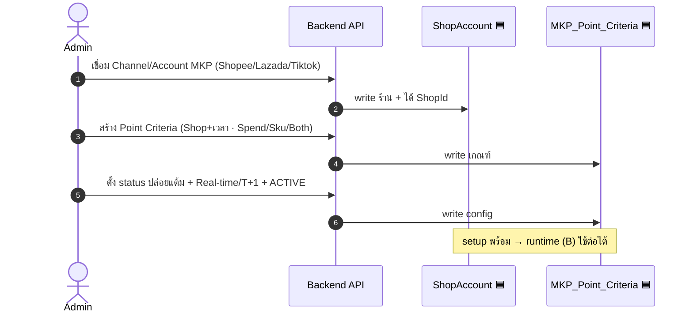
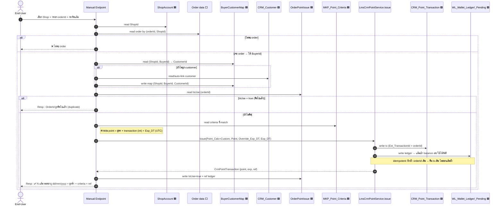

# Sequence Diagram — Setup + End-User Flow + DB (คร่าวๆ)

> [!info] มุมมองแบบ sequence ของ [[09-System-Relation-Graph]]
> เรียงตามเวลา: ใครเรียกใคร, อ่าน/เขียน table ไหน. 🟩 core · 🟦 ใหม่ · ⬜ ยังไม่รู้ table

## (A) Setup — admin เปิดร้าน/ตั้งค่า (ครั้งเดียว)

## (B) End-user flow — End-User คิดแต้มจาก orderId (one-shot)

