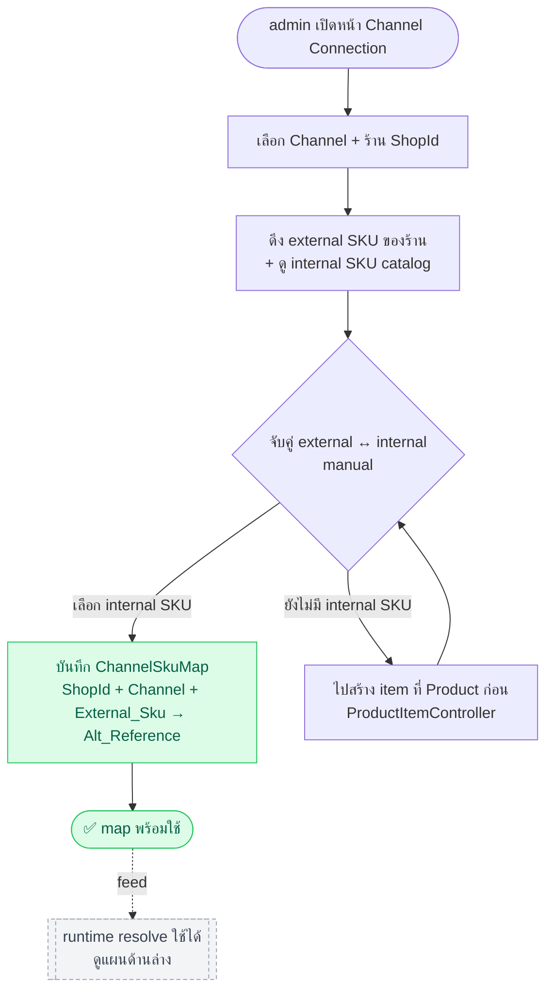
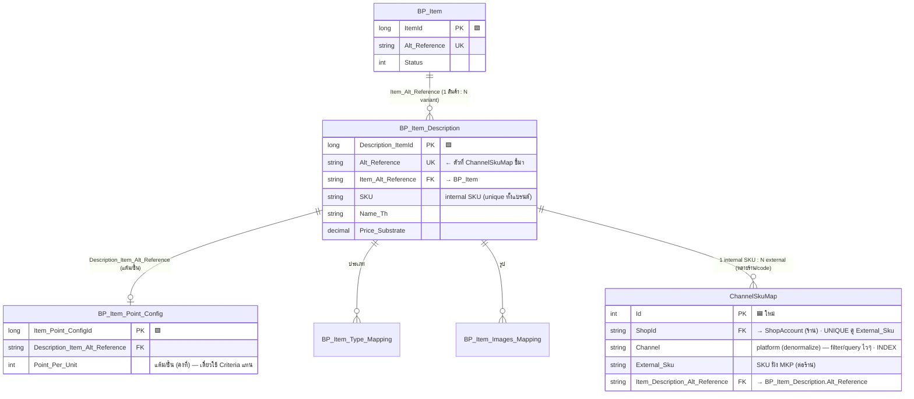
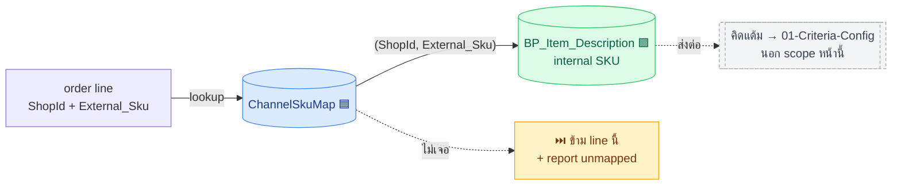

# SKU — สรุปเรื่องคิดแต้มราย SKU

> 🔗 เกี่ยวข้อง: criteria [[01-Criteria-Config]] · ที่มา mockup [[06-MKP-Reference]] · journey [[07-User-Journey]] · graph [[09-System-Relation-Graph]] · seq [[10-Sequence-Diagram]]

> [!summary] SKU คืออะไรในงานนี้
> SKU = รหัสสินค้าราย item ในหนึ่ง order (order มีได้หลาย SKU + จำนวน)
> ใช้เป็น **เกณฑ์คิดแต้มแบบเจาะรายสินค้า** — ตั้งแต้มให้เฉพาะ SKU ที่ระบุ
> (spend-based คิดจากยอดรวมอยู่คนละ track → อยู่ที่ [[01-Criteria-Config]])

## SKU-based ทำงานยังไง (design จริง → [[01-Criteria-Config]])
- ตั้งได้ **ทีละรายการ SKU** (ไม่ใช่เหมารวมทั้ง order) — เก็บใน `MKP_Point_Criteria_Sku`
- ผลลัพธ์ราย SKU เลือกเอง: **คงที่** (แต้ม/ชิ้น) หรือ **คูณ** (×`Point_Per_Unit` เดิม)
- กันชนที่ **config-time validate** (Shop+SKU+เวลา ห้ามทับ)
- หลาย criteria match order เดียว → **บวกกัน (stack)** ไม่มีลำดับ
- **ยังไม่มี Cap เพดานแต้ม** (YAGNI) — เพิ่มตอนมี requirement จริง (ถ้าเพิ่ม → shop-level clamp ผลรวม ไม่ใช่ราย config)
- ปล่อยแต้มเมื่อ order ถึง **status ปล่อยแต้ม** เท่านั้น — ( ยังไม่รู้ Status ที่แน่นอน ** ติดไว้ก่อน ว่าจะใช้ท่าไหนดี )

## data model ที่แตะ (final → [[01-Criteria-Config]])
- SKU bit อยู่ใน `MKP_Point_Criteria.Type` (bit `2=Sku`) → เปิด SKU-based ให้ criteria นั้น
- SKU list อยู่ `MKP_Point_Criteria_Sku` (Result_Mode คงที่/คูณ + Result_Value) ต่อ criteria
- ต้องอ่าน **order line items (SKU, qty)** จาก order ฝั่งเรา

## ผลต่อ flow คิดแต้ม
1. query order → ได้ **line items ราย SKU**
2. match SKU ใน order กับ SKU ที่ตั้งใน criteria
3. คิดแต้มราย SKU ที่ match แล้วรวม → `LmsCrmPointService.Issue`
> 📌 **สมมติ order ฝั่งเราเก็บ itemList (line-item ราย SKU)** — เป็น prerequisite ของทั้ง track (ไม่มี line-item = คิด SKU ไม่ได้) → schema `Order data ⬜` ต้องมี lines ([[03-Manual-Endpoint]])

## 🔎 โค้ดที่มีอยู่แล้ว (แงะจากของจริง 2026-08-24)
> ⚠️ ชื่อ table จริงคือ `BP_Item_Description` — SKU เก็บที่นี่

### 1) Product catalog — SKU + แต้มต่อชิ้น มีครบแล้ว
โครง 3 ชั้น (brand product DB, ผูกกันด้วย `Alt_Reference`):
```
BP_Item (สินค้าหลัก)
  └─ BP_Item_Description (variant = ตัวที่ถือ SKU)   ← SKU อยู่ตรงนี้
       ├─ BP_Item_Type_Mapping (ประเภท)
       ├─ BP_Item_Images_Mapping (รูป default)
       └─ BP_Item_Point_Config → Point_Per_Unit    ← "แต้มต่อ 1 ชิ้น" ของ SKU นั้น
```
- **API มีแล้ว**: `ProductItemController` → `List` / `Detail/{itemId}` / `Add` / `Edit/{itemId}` / `ChangeStatus` / `Delete`
  (`Detail` resp = `Descriptions[]` มี `Sku`, `NameTh/En`, `Status`, `PointConfig{ ItemPointConfigId, PointPerUnit }`)
- core: `LmsItemService.GetItemDetail` / `GetItemDetailList` / `UpsertItem` (`Choco.LMS.Core/Services/Product/`)
- **SKU validation** (`ValidateSku`): ห้ามอักษรไทย, ต้องมี a-z0-9 อย่างน้อย 1, ≤100 ตัว, **unique ทั้งแบรนด์** (non-deleted)
- `ItemPointConfigList` / `ItemPointConfig` = feed dropdown "เลือก SKU ที่จะให้แต้ม" (value=`Item_Point_ConfigId`, label=SKU+ชื่อ+`Point_Per_Unit`)

### 2) Document (ใบเสร็จ) — คิดแต้มราย SKU มีทำไปแล้วบางส่วน! 🎯
`DocumentEditReq` มี field ราย SKU ที่ตรงกับ concept เราเป๊ะ:
- `SkuLines[]` = `{ ItemPointConfigId, Qty, PointPerUnit }` → คิดแต้มราย SKU × จำนวน
- `PointPerUnit` ใน SkuLine เป็น **snapshot** (default จาก catalog แต่แก้ได้ → ต่างจาก `Point_Per_Unit` ปัจจุบันได้)
- (`ReceiptPointType` bit `2=Sku` เปิด track นี้ — ตัว bitflag รวมอยู่ที่ [[01-Criteria-Config]])

### 💡 สรุปช่องว่าง (gap กับงานเรา)
- ✅ มีแล้ว: master SKU + แต้มต่อชิ้น, dropdown เลือก SKU, engine คิดแต้มราย SKU (ฝั่ง Document)
- ⚠️ ต่าง: ของเดิมเป็น **แต้มต่อชิ้น (Point_Per_Unit, ค่าคงที่)** ส่วนเราให้เลือก **คงที่/ตัวคูณ** ราย SKU
- ❓ งาน manual-order = **reuse pattern SkuLines/Point_Per_Unit นี้กับ order จาก MKP** → เทียบใน [[01-Criteria-Config]] TODO

## 🗺️ Channel ↔ SKU Mapping (external → internal) — งานหลักที่จะทำ
> ปัญหา: SKU ของเรามีชุดเดียว (`BP_Item_Description.SKU`) แต่ order จริงมาหลาย channel ที่มี SKU code ของตัวเอง
> เช็คแล้ว **ยังไม่มี table/model ไหนเก็บ external/channel SKU** (grep marketplace/shopee/external-sku ใน DBModel = ว่าง) → งานใหม่
> รูปแบบเดียวกับ [[08-Buyer-Customer-Mapping]] แค่เปลี่ยน "คน" เป็น "สินค้า"

**ตัดสินใจแล้ว: key ระดับร้าน** `(ShopId, External_Sku)` — ต่อร้าน ไม่ใช่ต่อ platform
- ร้าน A/B บน Shopee ตั้ง SKU code ของตัวเองได้อิสระ → **map แยกต่อร้าน** (ไม่ assume ว่าเหมือนกันทั้ง platform)
- registry เก็บครบทุกร้าน
- **เก็บ `Channel` ไว้ด้วย** (denormalize จาก ShopAccount — ค่าไม่เปลี่ยน เก็บซ้ำปลอดภัย) → filter/query หน้าจัดการ map ตาม platform ได้ไวๆ ไม่ต้อง join

```
ChannelSkuMap
- Id
- ShopId                           FK → ShopAccount (ร้าน)
- Channel                          ← platform (denormalize จาก shop) — filter/query หน้า map ให้ไว
- External_Sku                     ← SKU ฝั่ง MKP (ต่างร้านใช้ code ต่างกันได้)
- Item_Description_Alt_Reference   ← ชี้ internal SKU (BP_Item_Description) — ref เสถียรที่ criteria/Point_Config ห้อยอยู่
UNIQUE (ShopId, External_Sku)      ← lookup ตอน earn: key ตรงตัว
INDEX  (Channel)                   ← filter "map ของ Shopee ทั้งหมด" หน้าจัดการ
# ponytail: ยังไม่มี MapMethod — เฟสแรก manual ล้วน (ค่าเดียว). เติมกลับตอนทำ auto-map
INDEX  (Item_Description_Alt_Reference)
```
> ชี้ที่ `Alt_Reference` ไม่ใช่ SKU string / ไม่ใช่ Item_Point_ConfigId → แยก "mapping (external→internal identity)" ออกจาก "คิดแต้ม" (ปล่อยให้ Criteria Config จัดการ)

**flow (หน้านี้ = map external↔internal เท่านั้น):** order line `(ShopId, External_Sku)` → lookup → **ได้ internal description แล้วจบ**
> การคิดแต้มต่อจาก internal description เป็นงานของ [[01-Criteria-Config]] ไม่ใช่หน้านี้

### 🧑‍💼 Journey: admin สร้าง map (setup — manual, ทำก่อน runtime)
> ต่อจาก [[07-User-Journey]] (A) admin setup — อยู่ใต้ Channel Connection submodule
> เฟสนี้ **สร้างของ** ให้ runtime resolve ด้านล่างเอาไปใช้ (ไม่มี map = order คิด SKU ไม่ได้)


> unmapped ตอน runtime (order มี external SKU ที่ admin ยังไม่จับคู่) → **ข้าม line + report** → admin กลับมาเฟสนี้เพิ่ม map ทีหลัง

## 🕸️ กราฟโยง table (เดิม 🟩 + ใหม่ 🟦)
> 🟩 มีจริงใน core (brand product DB, ผูกกันด้วย `Alt_Reference`) · 🟦 ต้องสร้างใหม่ (งานเรา)



**runtime: map external → internal (ตอน earn — หน้านี้จบแค่นี้):**

> UNIQUE `(ShopId, External_Sku)` · INDEX `Item_Description_Alt_Reference`
> เชื่อมกับกราฟรวมทั้งระบบที่ [[09-System-Relation-Graph]] (ChannelSkuMap นั่งระหว่าง Order data ⬜ กับ MKP_Point_Criteria 🟦)

## Requirements (นิ่งแล้ว ✅)
- [x] **unmapped external SKU** → **ข้าม line นั้น** คิด line ที่เหลือปกติ + resp แจ้งว่ามี SKU ไหน unmapped (ไม่บล็อกทั้ง order — SKU แปลกตัวเดียวไม่ทำ order ล่ม)
- [x] **auto-map**: **manual อย่างเดียวก่อน** — admin ผูก external→internal เอง · auto-match SKU ตรงตัวไว้เฟสหลัง (YAGNI)
- [x] **granularity**: map ชี้ `BP_Item_Description.Alt_Reference` (variant) — ถ้า MKP ให้ระดับ item ก็ map ลง Description ตัวแทน ตัว map ดูดความต่างไว้เอง
- [x] **ใครดูแล/UI**: ใต้ Channel Connection submodule ([[06-MKP-Reference]]), admin ดูแล
- [x] **SKU code ต่างร้าน/ต่าง channel format ต่างกัน**: ใช่ — เลยมี `ChannelSkuMap` คีย์ `(ShopId, External_Sku)` **ต่อร้าน** รับความต่างอยู่แล้ว
- [x] 1 order หลาย SKU-criteria / SKU+spend → **บวกกัน (stack)** · ไม่มี priority · config-time กันซ้ำ Shop+SKU+เวลา → [[01-Criteria-Config]]
- [x] **order ฝั่งเราเก็บ line-item ราย SKU** — สมมติว่ามี (prerequisite ของ SKU track) → schema `Order data ⬜` ต้องมี lines (SKU, qty) ไม่ใช่แค่ยอดรวม ตอนออกแบบ [[03-Manual-Endpoint]]
